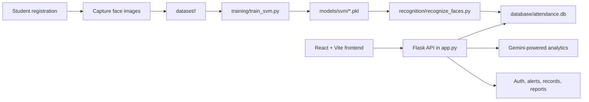

# Ocular Attendance System

Smart, full-stack face attendance platform with a Flask backend, a React + Vite dashboard, SQLite storage, and an ML pipeline for face capture, training, recognition, liveness detection, and Gemini-powered analytics.

## Project Overview

Ocular Attendance System is built to register students, capture face images, train an attendance model, recognize faces in real time, and store attendance data for review through a web dashboard. The backend, frontend, and ML scripts are kept as separate layers so the capture, training, recognition, and reporting flows stay easy to maintain.

## Backend / Frontend / ML Overview

The backend is a Flask API in [app.py](app.py) and supporting modules under [auth/](auth), [database/](database), and [ml_services/](ml_services). It handles authentication, attendance APIs, Gemini-based AI chat and analytics, and orchestration of capture/training/recognition jobs.

The frontend lives in [frontend/](frontend) and uses React with Vite. The UI is organized into dashboard and records components under [frontend/src/components/ocular](frontend/src/components/ocular) and [frontend/src/components/records](frontend/src/components/records).

The ML workflow uses [ml_services/capture_student.py](ml_services/capture_student.py), [training/train_svm.py](training/train_svm.py), [recognition/recognize_faces.py](recognition/recognize_faces.py), and [liveness/test_blink.py](liveness/test_blink.py) to capture faces, train an SVM classifier, perform recognition, and verify liveness with blink detection.

## Features

- Student face capture into per-student dataset folders
- RetinaFace-based face detection during capture
- FaceNet embeddings with SVM-based recognition
- Blink-based liveness verification during attendance logging
- SQLite-backed attendance and admin data storage
- Role-based authentication and user management support
- Gemini-powered natural-language analytics assistant
- Dashboard pages for live attendance, class management, records, alerts, logs, and reports

## Tech Stack

- Python 3
- Flask
- SQLite
- OpenCV
- RetinaFace
- MediaPipe
- FaceNet / keras-facenet
- scikit-learn
- TensorFlow
- pandas and NumPy
- React
- Vite
- Recharts
- Lucide React
- Flask-CORS
- python-dotenv
- Google Generative AI SDK

## Architecture Overview



1. Students are enrolled by capturing face images into a folder under [dataset/](dataset).
2. The training script reads those images, builds FaceNet embeddings, and trains an SVM model.
3. The recognition script loads the saved model and label encoder, then logs attendance to SQLite.
4. The frontend calls the Flask API for dashboards, records, authentication, and analytics.
5. Gemini is used by the backend for AI chat / attendance analytics queries.

## Quickstart / Setup

From a fresh clone, install the backend and frontend dependencies separately.

```bash
python -m venv .venv
.\.venv\Scripts\activate
pip install -r requirements.txt
cd frontend
npm install
```

If you prefer to use the provided environment file, you can also create a Conda environment from [environment.yml](environment.yml).

## Backend Run Steps

1. Set up your environment variables in a root `.env` file.
2. Install the Python dependencies.
3. Start the Flask application from the repository root.

```bash
python app.py
```

The backend starts at `http://127.0.0.1:5000`.

## Frontend Run Steps

1. Open the [frontend/](frontend) directory.
2. Install dependencies if you have not already done so.
3. Start the Vite development server.

```bash
cd frontend
npm run dev
```

Build the frontend for production with:

```bash
npm run build
```

## Demo Flow / How the System Works

1. Register or select a student from the backend or dashboard workflow.
2. Capture face images using the registration capture pipeline.
3. Train the model so the dataset is converted into embeddings and an SVM classifier.
4. Start live recognition and blink detection to confirm a real user.
5. Save attendance records to SQLite.
6. Review live attendance, records, alerts, logs, and analytics in the frontend.
7. Use the Gemini-powered assistant to query attendance data in natural language.

## Testing

The repository includes lightweight validation scripts rather than a full automated test suite.

```bash
python accuracy_test/test_accuracy.py
python liveness/test_blink.py
```

- `accuracy_test/test_accuracy.py` is a small model-evaluation harness.
- `liveness/test_blink.py` opens the webcam and checks blink-based liveness detection.

## Folder Structure

```text
.
├── app.py
├── auth/
├── capture/
├── database/
├── dataset/
├── environment.yml
├── frontend/
│   └── src/
│       ├── components/
│       │   ├── ocular/
│       │   └── records/
│       └── utils/
├── liveness/
├── ml_services/
├── models/
├── recognition/
├── training/
├── accuracy_test/
└── requirements.txt
```

## Configuration and Secrets

Create a root `.env` file for runtime configuration.

Common variables used by the backend include:

- `GEMINI_API_KEY` - required for Gemini-powered analytics features
- `GEMINI_MODEL` - optional, defaults to `gemini-2.5-flash`
- `ALERT_CHECK_INTERVAL_SEC` - optional alert polling interval
- `OCULAR_DEPARTMENT_CODE` - optional department context for recognition
- `OCULAR_PERIOD_NUMBER` - optional period context for recognition

The SQLite database is created under [database/attendance.db](database/attendance.db) when the application initializes.

## Screenshots

Add screenshots here for the main dashboard, live attendance page, records pages, analytics reports, and AI assistant view.

## Future Scope

- Better attendance analytics and trend reporting
- Improved training and evaluation automation
- Deployment-ready configuration for production hosting
- Expanded admin workflows for users, classes, and alerts
- Smarter Gemini-assisted reporting and insights

## License

No license file is currently declared in the repository. Add one before public distribution if you want to make the project open source.
